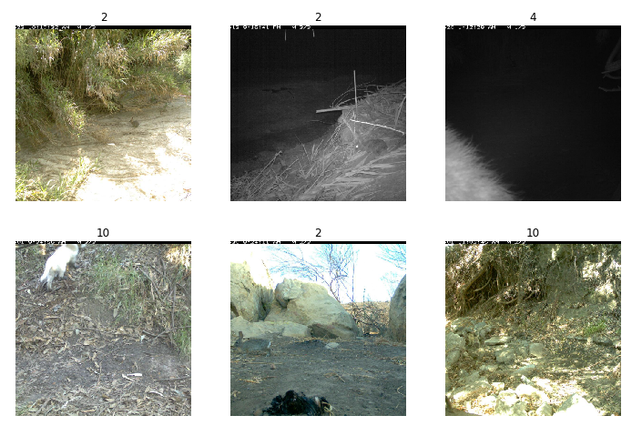
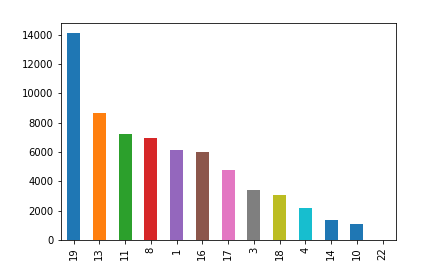
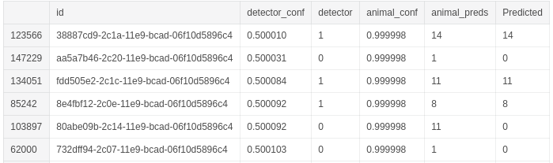

[Competition Page](https://www.kaggle.com/c/iwildcam-2019-fgvc6/overview)

> "how do you classify a species in a new region that you may not have seen in previous training data?". 

In essence this challenge asks you to identify different species of animals from trail cam images.

<!--truncate-->

I used fastai as it is an awesome library that allows for fast prototyping with built in best practices and feature like learning rate scheduling. Their data api also saves a lot of time in preprocessing data and creating train, validation and test sets. This allows you more time to focus on improving the performance of your solution. Also fastai V3 Part2 is coming out next month so I wanted to get comfortable with the library before tackling that course.

As you can see from the above images there is a range of challenges in this data set. Including small regions of interest (top left), images taken at night(top middle) and perspective (top right) to name just a few.

Another issue was the huge class imbalances present in the data set.  In the graph below you can see the class distributions. The empty class (which had 131,457 samples, over 67% of the training data) was removed. The mountain lion (22) had the fewest samples with only 33 training examples.

My initial thought was I needed to train on large images if my model had any chance of detecting the smaller animals. So probably starting off with a smaller network like resnet34 the that would allow me to train on bigger crops sizes while still maintaining a reasonable batch size.

The first approach was to remove all the empty class images, train a model on only images containing animal then use the class probabilities and some threshold. eg: If the model didn't predict a class with a confidence of at least 0.4 the i would set the class to empty. This approach didn't work well with  a public LB score of 0.108. It was hard to find a threshold that worked well. Although I could have tried some other approaches to find a good threshold(run inference on the entire train set and test various how thresholds performed) I decided to try a second approach.

My second approach involved creating binary classifier, which would just predict if an animal was in an image. I then combined the results from these two models. If the animal detector model detects an animal I use the images class prediction as its final prediction other wise it will just be predicted as empty. This got me a public LB score of 0.156 and shot me up to 17th  place.

Looking at the class probabilities I could see that there was still opportunity for improvement.

Some predictions from the animal detector where right on the threshold, predicting no animal was in image with 0.5001 confidence while the animal classifier was predicting a elk with a 0.999 confidence(see above second last row). After finding a few more of these examples and checking the images I knew that there was potential to improve mmy results. I could try another threshold approach but thought a small Neural Net might be a fun solution.

I used a small two layer neural network. Although my training and validation results were good the results didn't carry through to the test set. So I knew the issue was probably in the accuracy of my classifier and animal detector.

Unfortunately I ran out of time to carry on working on this challenge but there are a couple of things i could have tried to improve accuracy.

1) Utilising saliency maps to crop out the regions of interest so the model as more of the animal in the image.

2) More data augmentation that replicates common features in the images eg: occlusion, darkness 

> Note: There were bounding box annotations for the a subset of the training data but i choose not to use them