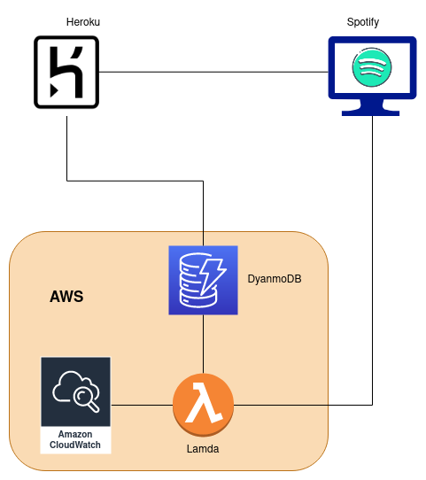
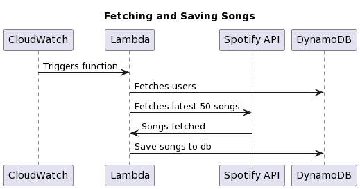

Spotify Wrapped is cool, but I wanted to gain a more in-depth understanding of my music listening habits. Unfortunately, Spotify's API doesn't provide full access to your listening history. However, the next best option is to fetch the latest 50 tracks you've listened to. With this limitation in mind, I set out to create a project that could start recording all the songs I listened to and perform data analysis on them.

<!--truncate-->

## Architecture

The basic architecture of the app consists of a serverless function that runs every 6 hours to fetch the latest songs you've listened to and stores them in a database. I can then query this database to perform various analyses. Additionally, I developed a web app that acts as an API, allowing users to register to have their own history tracked and proivide a full history of their songs.

To implement this I decided to leverage AWS services for fetching and storing the latest songs, while deploying the web app for registration and song viewing on Heroku.

Below is a high-level architecture diagram illustrating the components involved:

## Registration/Viewing

For registration and song viewing, I utilized [Spotify](https://github.com/spotipy-dev/spotipy) for interfacing with Spotify's API and built the web app using Flask. The app is then deployed on Heroku, providing a seamless experience for users to register and access their tracked songs.

## Saving History

To save the song history, I employed CloudWatch to trigger a function every 6 hours. This function fetches the users from the database and retrieves their latest songs, which are then added to DynamoDB for storage.

By tracking all the songs I listen to over the next year, I'll be able to create a more comprehensive Spotify Wrapped experience, delving deeper into my music preferences and habits.

Here is a [LINK](https://github.com/ShaunSpinelli/spotify_history) to the repo and the specfic [lambda](https://github.com/ShaunSpinelli/spotify_history/blob/master/lambdas/lambda_function.py) for fetcing the latest songs. 

