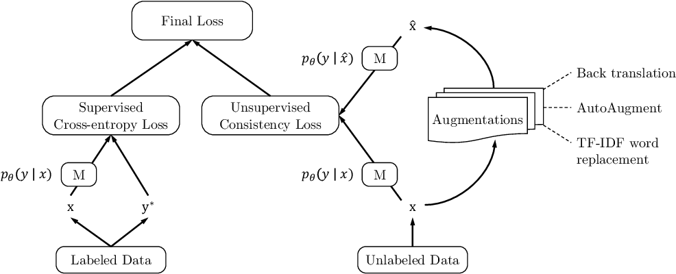
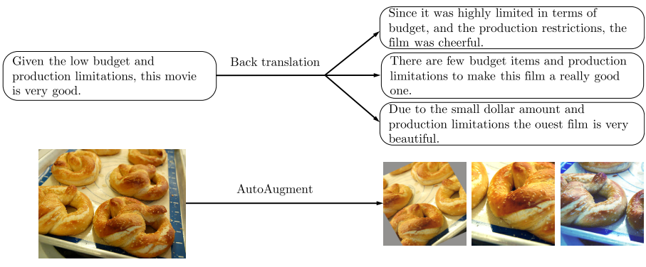
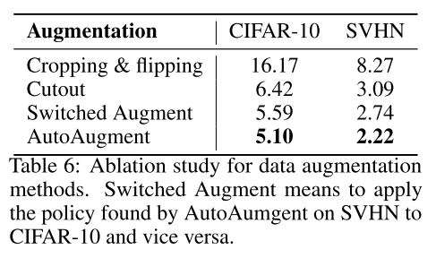
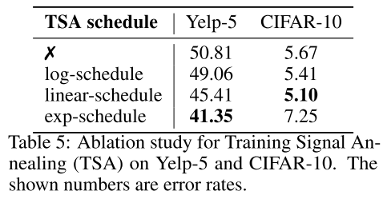
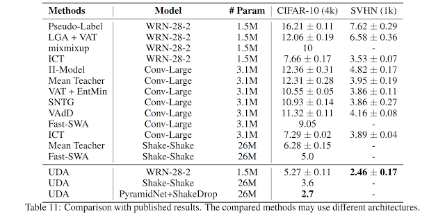

I look into a paper that introduces a fresh perspective on the role of advanced data augmentation methods in semi-supervised learning, showcasing remarkable results across various language and vision tasks. I show the key findings and dive into code examples that highlight the power of these techniques

[[Paper]](https://arxiv.org/abs/1904.12848) [[Blog Post]](https://ai.googleblog.com/2019/07/advancing-semi-supervised-learning-with.html)

<!--truncate-->

All code snippets taken from this [repository](https://github.com/google-research/uda)

### Key Ideas and Findings

- Improving classification models with unlabeled data, data augmentation and semi-supervised learning. 

- Combining both labelled and unlabeled and using a custom loss function you can train a classifier for both computer vision and nlp problems.

- Matches and outperforms supervised learning approaches with only a fraction of the data. 


### Key Results

1 - Using CIFAR-10 with 4k examples, UDA achieves an error rate of 5.27, matching the performance of a fully supervised model that uses 50k examples

2 - UDA achieves a new state-of-the-art error rate with a more than 45% reduction in error rate compared to the previous best semi-supervised result.

3 - On SVHN, UDA achieves an error rate of 2.46 with only 1k labeled examples, matching the performance of the fully supervised model trained with ~70k labeled examples.


## Components

###  Loss Function

This loss function is calculated by combining two loss functions one for the supervised part of the data (labelled) and one for the unsupervised part of the data (UDA). There is also a weighting factor **λ** applied to the UDA loss function, researchers set **λ** to 1 for most of their experiments.
 
**Supervised Loss (Labelled Data)-**  Cross entropy

**Unsupervised Consistency Loss (Unlabelled Data)-** more specifically KL divergence, it is calculated between predicted distributions on the unlabeled examples and unlabeled augmented example.

### Implementation of KL-divergence

```python title="uda/image/main.py"
# q_logits are the augmented logits 
def _kl_divergence_with_logits(p_logits, q_logits):
    p = tf.nn.softmax(p_logits)
    log_p = tf.nn.log_softmax(p_logits)
    log_q = tf.nn.log_softmax(q_logits)
    kl = tf.reduce_sum(p * (log_p - log_q), -1)
return kl

```



## Augmentation Strategies

Image augmentation was done using  **AutoAugment** [[Paper]](https://ai.googleblog.com/2018/06/improving-deep-learning-performance.html) [[Medium]](https://towardsdatascience.com/how-to-improve-your-image-classifier-with-googles-autoaugment-77643f0be0c9) and **Cutout** [[Paper]](https://arxiv.org/abs/1708.04552) was also used for experiments with CIFAR-10 and SVHN. It is noted that there is a trade off between having diverse augmented training examples and at the same time keeping the ground truth label matched. Many augmented samples where created for one ground truth and were all generated offline before training.

Text augmentation was done using back translation and a process called TF-IDF.



**Results from ablation study on different augmentation strategies**




## Additional Training Techniques

### Training Signal Annealing

By training on sch a small number of training samples there was a risk of the model overfitting to the labelled data. To negate that researches used (TSA) with the idea being to *gradually release training signals of the labeled data without overfitting as the model is trained on more and more unlabeled examples.*

When the probability of the correct category is higher the some threshold then that example is removed from the loss calculation. This threshold prevents the model from over-training on examples it is already confident on.

Three threshold schedules were suggested with the decision on which to use dependant on the different ratios of labeled and unlabeled data.

**log-schedule** where threshold is increased most rapidly at the beginning of training. Used when the model is **less** likely to overfit because of abundance of labeled examples or effective regularizations in the model.

**exp-schedule** where threshold is increased most rapidly at the end of training. Used when the problem is **more** likely to overfit because of a relatively easy problem or the number of training examples is limited. The supervising signal get mostly released by the end of training.

**linear-schedule** where the threshold is linearly increased while training.


**Results from ablation study on different TSA schedules**



### Implementation of TSA

```python title="uda/image/main.py"

def get_tsa_threshold(schedule, global_step, num_train_steps, start, end):
  step_ratio = tf.to_float(global_step) / tf.to_float(num_train_steps)
  if schedule == "linear_schedule":
    coeff = step_ratio
  elif schedule == "exp_schedule":
    scale = 5
    # [exp(-5), exp(0)] = [1e-2, 1]
    coeff = tf.exp((step_ratio - 1) * scale)
  elif schedule == "log_schedule":
    scale = 5
    # [1 - exp(0), 1 - exp(-5)] = [0, 0.99]
    coeff = 1 - tf.exp((-step_ratio) * scale)
  return coeff * (end - start) + start

# Usage 
# line 258
 eff_train_prob_threshold = get_tsa_threshold(
      FLAGS.tsa, global_step, FLAGS.train_steps,
      tsa_start, end=1)

# line 276
 larger_than_threshold = tf.greater(
      correct_label_probs, eff_train_prob_threshold)

```

### Sharpening Predictions

- **Confidence-based masking** - If the predictions on the labelled data is below some confidence threshold then these predictions are removed from the final loss calculation, leaving only predictions with the highest confidence probabilities.

### Implementation
```python title="uda/image/main.py"

ori_prob = tf.nn.softmax(ori_logits, axis=-1)
largest_prob = tf.reduce_max(ori_prob, axis=-1)
loss_mask = tf.cast(tf.greater(largest_prob, FLAGS.uda_confidence_thresh), tf.float32)
# metric_dict["unsup/high_prob_ratio"] = tf.reduce_mean(loss_mask)
loss_mask = tf.stop_gradient(loss_mask)
aug_loss = aug_loss * loss_mask
# metric_dict["unsup/high_prob_loss"] = tf.reduce_mean(aug_loss)

```

- **Entropy minimization**

- **Softmax temperature controlling**

### Domain-relevance Data filtering

If the class distribution between the labeled and unlabeled data sets are unmatched it can hurt the performance of the model. To try and match the class distributions between the labeled and unlabeled data a model was trained on the labeled samples and used to infer the unlabeled samples class. Examples that the model was most confident on where then used for training.

### Comparison to current approaches

